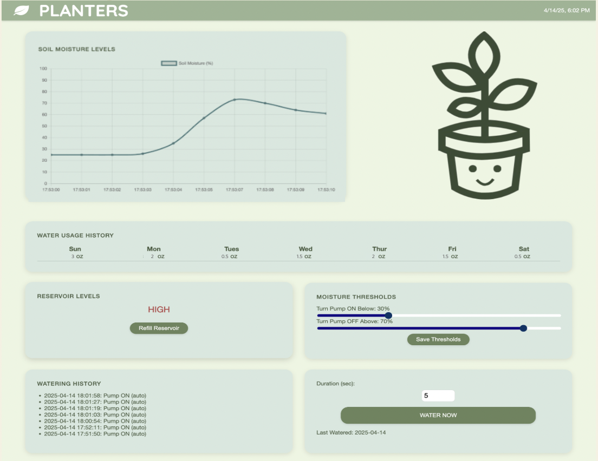

# Planters - Smart Plant Watering System

Planters is a smart plant monitoring and watering system powered by a Raspberry Pi. It automatically reads soil moisture levels from a sensor, activates a water pump when needed, and logs data for moisture, watering events, and reservoir usage. A web-based dashboard allows users to monitor and control the system in real time.

## Features

- Automatic watering based on adjustable moisture thresholds
- Real-time soil moisture graph with zoom and pan
- Manual pump control with duration setting
- Historical logs of watering events and moisture readings
- Weekly water usage summary
- Adjustable reservoir capacity with HIGH/LOW status display
- Responsive web dashboard served by Flask

## Hardware Used

- Raspberry Pi (tested on Pi 3 Model B+)
- LM393 3.3V-5V Soil Moisture Sensor
- EK1893 Mini Submersible Water pump and relay module
- MCP3008 ADC for analog input
- Optional: tubing and reservoir setup

## Software Stack

- Python (Flask backend)
- SQLite for local data storage
- Chart.js for interactive graphing
- HTML/CSS/JavaScript for frontend
- RPi.GPIO and Adafruit CircuitPython libraries for sensor control

## Setup Instructions

1. Clone the repository:
   ```bash
   git clone https://github.com/yourusername/planters.git
   cd planters

## Required Installations
- pip install flask adafruit-circuitpython-mcp3xxx

## Activating the Project
- python3 server.py
- go to http://<raspberry-pi-ip>:5000 to see data

## File Structure
- server.py: Main Flask app and GPIO logic
- static/: CSS and image assets
- templates/index.html: Frontend dashboard
- plant_data.db: SQLite database storing thresholds, history, and reservoir data



